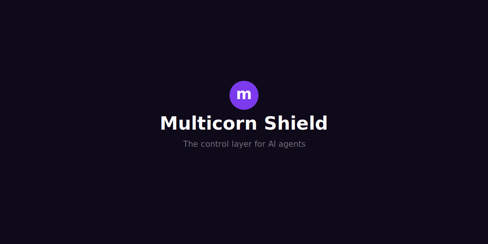

# Multicorn Shield

The permissions and control layer for AI agents. Open source.

[](https://github.com/Multicorn-AI/multicorn-shield/actions/workflows/ci.yml)
[](https://github.com/Multicorn-AI/multicorn-shield)
[](https://www.npmjs.com/package/multicorn-shield)
[](LICENSE)
[](https://bundlephobia.com/package/multicorn-shield)

## Demo

<p align="center">
  
</p>

## Why?

AI agents are getting access to your email, calendar, bank accounts, and code repositories. Today, most agents operate with no permission boundaries: they can read, write, and spend with no oversight. Multicorn Shield gives developers a single SDK to enforce what agents can do, track what they did, and let users stay in control.

## Quick Start

### Option 1: Wrap your existing agents (no code changes)

Already using an MCP server with Claude Code, OpenClaw, or another agent? Add Shield as a proxy in front of it. No code changes required: the proxy intercepts every tool call, enforces permissions, and logs activity to your dashboard.

**Step 1: Install**

```bash
npm install -g multicorn-shield
```

**Step 2: Set up your API key**

```bash
npx multicorn-proxy init
```

**Step 3: Wrap your MCP server**

```bash
npx multicorn-proxy --wrap <your-mcp-server>
```

For example, to wrap the MCP filesystem server:

```bash
npx multicorn-proxy --wrap npx @modelcontextprotocol/server-filesystem /tmp
```

That's it. Every tool call now goes through Shield's permission layer, and activity appears in your [Multicorn dashboard](https://app.multicorn.ai) in real time.

See the [full MCP proxy guide](https://multicorn.ai/docs/mcp-proxy) for Claude Code, OpenClaw, and generic MCP client examples.

### Claude Desktop Extension (.mcpb)

Install Shield without the terminal: download the `.mcpb` bundle (or use **Install** from the Shield product page), open it in Claude Desktop, and enter your API key when prompted. The extension reads your existing MCP servers from `claude_desktop_config.json`, runs them as child processes, merges their tools, and checks every `tools/call` with the Shield API. Activity still shows up in your [Multicorn dashboard](https://app.multicorn.ai).

**Disable or uninstall recovery:** On each start the extension saves a copy of your `mcpServers` block to `~/.multicorn/extension-backup.json`. If you turn the extension off and need your original Claude Desktop MCP entries back, run:

```bash
npx multicorn-shield restore
```

Then restart Claude Desktop. That overwrites `mcpServers` in your config with the last backup.

**Duplicate tool names:** If two MCP servers expose the same tool name, the first server in your config file keeps the name. The duplicate is skipped and a warning is written to the extension logs (stderr). Rename tools on the server side if you need both.

**Extension icon:** The repo ships a minimal placeholder `icon.png` for packaging. TODO: replace with a proper PNG export from the Multicorn learn site favicon at `multicorn-learn/public/learn/favicon.svg` (relative to the monorepo root).

Build the bundle locally (requires a full `pnpm build` first):

```bash
pnpm run pack:extension
```

This runs `mcpb validate` and writes `dist/multicorn-shield.mcpb`.

### Option 2: OpenClaw Plugin (native integration)

If you're running [OpenClaw](https://openclaw.ai), Shield integrates directly as a plugin. No proxy layer, no code changes. The plugin intercepts every tool call at the infrastructure level before it executes.

**Step 1: Install and configure**

```bash
npm install -g multicorn-shield
npx multicorn-proxy init
```

Enter your API key when prompted. This saves your key to `~/.multicorn/config.json` and configures the OpenClaw hook environment.

**Step 2: Build the plugin**

```bash
cd $(npm root -g)/multicorn-shield
npm run build
```

**Step 3: Register with OpenClaw**

Add the plugin path to your `~/.openclaw/openclaw.json`:

```json
{
  "plugins": {
    "load": {
      "paths": ["<npm-root>/multicorn-shield/dist/openclaw-plugin/index.js"]
    },
    "entries": {
      "multicorn-shield": {
        "enabled": true
      }
    }
  }
}
```

Replace `<npm-root>` with the output of `npm root -g`.

**Step 4: Restart and verify**

```bash
openclaw gateway restart
openclaw plugins list
```

You should see `multicorn-shield` in the loaded plugins list.

**How it works**

1. Agent tries to use a tool (read files, run commands, send emails)
2. Shield intercepts via `before_tool_call` and checks permissions
3. First time: A consent screen opens in your browser so you can authorize the agent
4. Authorized actions: Proceed immediately
5. New or elevated actions: Blocked with a link to the dashboard where you approve or reject
6. Everything is logged to your Multicorn dashboard

The plugin maps OpenClaw tools to Shield permission scopes automatically:

| OpenClaw Tool       | Shield Scope     |
| ------------------- | ---------------- |
| read                | filesystem:read  |
| write, edit         | filesystem:write |
| exec                | terminal:execute |
| exec (rm, mv, sudo) | terminal:write   |
| browser             | browser:execute  |
| message             | messaging:write  |

Destructive commands (rm, mv, sudo, chmod) are detected automatically and require separate write-level approval.

### Option 3: Integrate the SDK

For full control over consent screens, spending limits, and action logging, use the SDK directly in your application code.

```bash
npm install multicorn-shield
```

```typescript
import { MulticornShield } from "multicorn-shield";

const shield = new MulticornShield({ apiKey: "mcs_your_key_here" });

const decision = await shield.requestConsent({
  agent: "OpenClaw",
  scopes: ["read:gmail", "write:calendar"],
  spendLimit: 200,
});

await shield.logAction({
  agent: "OpenClaw",
  service: "gmail",
  action: "send_email",
  status: "approved",
});
```

That gives you a consent screen, scoped permissions, and an audit trail.

## Dashboard

Every action, approval, and permission is visible in real time at [app.multicorn.ai](https://app.multicorn.ai).

**Sign up:** [https://app.multicorn.ai](https://app.multicorn.ai)

With the dashboard you can:

- See all agents and their activity
- Approve or reject pending actions
- Configure per-agent permissions (read/write/execute per service)
- Set spending limits
- View the full audit trail with hash-chain integrity

The dashboard works with both the SDK integration and the MCP proxy. No extra setup needed.

<p align="center">
  
</p>

<p align="center">
  
</p>

<p align="center">
  
</p>

<p align="center">
  
</p>

<p align="center">
  
</p>

## Built with Shield

Multicorn is developed using AI coding agents. Primarily Cursor for code generation and GitHub Actions as the deployment agent. Every one of those agents runs under Shield.

We're not just building a trust layer for AI agents. We're depending on it ourselves. If Shield fails to catch something in our own workflow, we feel it directly.

[Read how we use agents to build Multicorn →](https://multicorn.ai/blog/agents)

## Features

### Consent Screens

A drop-in web component (Shadow DOM, framework-agnostic) that lets users review and approve agent permissions before granting access.

```typescript
const decision = await shield.requestConsent({
  agent: "OpenClaw",
  scopes: ["read:gmail", "write:calendar", "execute:payments"],
  spendLimit: 500,
  agentColor: "#8b5cf6",
});

// decision.grantedScopes - what the user actually approved
```

### Scopes

Type-safe permission scopes with built-in services (Gmail, Calendar, Slack, Drive, Payments, GitHub, Jira) and a registry for custom ones.

```typescript
import { createScopeRegistry, parseScope } from "multicorn-shield";

const registry = createScopeRegistry();

registry.register({
  name: "analytics",
  description: "Internal analytics platform",
  capabilities: ["read", "write"],
});

const scope = parseScope("read:analytics");
// { service: "analytics", permissionLevel: "read" }
```

### Action Logging

Structured audit trail of every action an agent takes. Supports immediate and batched delivery.

```typescript
await shield.logAction({
  agent: "OpenClaw",
  service: "gmail",
  action: "send_email",
  status: "approved",
  cost: 0.002,
  metadata: { recipient: "user@example.com" },
});
```

### Spending Controls

Client-side enforcement of per-transaction, daily, and monthly spend limits. Currency-safe integer arithmetic (cents) prevents floating point issues.

```typescript
const result = shield.checkSpending("OpenClaw", 849);

if (!result.allowed) {
  // "Action blocked: $849.00 exceeds per-transaction limit of $200.00"
  console.error(result.reason);
}
```

### MCP Integration

Middleware adapter for Model Context Protocol servers. Sits between the agent and MCP tools, enforcing permissions on every tool call.

```typescript
import { createMcpAdapter, isBlockedResult } from "multicorn-shield";

const adapter = createMcpAdapter({
  agentId: "inbox-assistant",
  grantedScopes: [
    { service: "gmail", permissionLevel: "execute" },
    { service: "calendar", permissionLevel: "read" },
  ],
  logger,
});

const result = await adapter.intercept(
  { toolName: "gmail_send_email", arguments: { to: "user@example.com" } },
  (call) => mcpServer.callTool(call.toolName, call.arguments),
);

if (isBlockedResult(result)) {
  console.error(result.reason);
}
```

## API Reference

Full API documentation is generated from source with TypeDoc:

```bash
pnpm run docs
```

This outputs to `docs/api/`. You can also browse the inline JSDoc on every public export. All interfaces, functions, and types are documented with examples.

## Architecture

Multicorn Shield is the client-side SDK in the Multicorn ecosystem. It runs in the browser or Node.js and communicates with the Multicorn hosted API for persistence and policy enforcement.

```
┌─────────────────────────────────────────────────────┐
│  Your Application                                   │
│                                                     │
│  ┌──────────────────────────────────────────────┐   │
│  │  multicorn-shield (this SDK)                 │   │
│  │                                              │   │
│  │  ┌────────────┐  ┌──────────┐  ┌──────────┐ │   │
│  │  │  Consent   │  │  Action  │  │ Spending │ │   │
│  │  │  Screen    │  │  Logger  │  │ Checker  │ │   │
│  │  └────────────┘  └────┬─────┘  └──────────┘ │   │
│  │  ┌────────────┐       │                      │   │
│  │  │  MCP       │       │                      │   │
│  │  │  Adapter   │       │                      │   │
│  │  └────────────┘       │                      │   │
│  └───────────────────────┼──────────────────────┘   │
│                          │ HTTPS                     │
└──────────────────────────┼──────────────────────────┘
                           │
                           ▼
              ┌────────────────────────┐
              │  Multicorn Service API │
              │  (hosted backend)      │
              └────────────┬───────────┘
                           │
                           ▼
              ┌────────────────────────┐
              │  Multicorn Dashboard   │
              │  (admin UI)            │
              └────────────────────────┘
```

The SDK handles:

- **Consent**: renders a Shadow DOM web component for permission approval
- **Scope validation**: parses and validates `"permission:service"` scope strings locally
- **Action logging**: sends structured events to the hosted API over HTTPS
- **Spending checks**: client-side pre-validation (server is the source of truth)
- **MCP adapter**: middleware layer between AI agents and MCP tool servers

The hosted API handles persistence, policy enforcement, and the audit trail. The SDK never stores credentials locally. API keys are held in memory only.

## Configuration

### `MulticornShieldConfig`

| Option      | Type              | Default                      | Description                                                                                                        |
| ----------- | ----------------- | ---------------------------- | ------------------------------------------------------------------------------------------------------------------ |
| `apiKey`    | `string`          | -                            | **Required.** Your Multicorn API key. Must start with `mcs_` and be at least 16 characters. Stored in memory only. |
| `baseUrl`   | `string`          | `"https://api.multicorn.ai"` | Base URL for the Multicorn API.                                                                                    |
| `timeout`   | `number`          | `5000`                       | Request timeout in milliseconds.                                                                                   |
| `batchMode` | `BatchModeConfig` | -                            | Optional batch mode for action logging. When enabled, actions are queued and flushed periodically.                 |

### `BatchModeConfig`

| Option            | Type      | Default | Description                               |
| ----------------- | --------- | ------- | ----------------------------------------- |
| `enabled`         | `boolean` | -       | Whether batch mode is active.             |
| `maxSize`         | `number`  | `10`    | Maximum actions to queue before flushing. |
| `flushIntervalMs` | `number`  | `5000`  | Maximum time (ms) between flushes.        |

### `ConsentOptions`

| Option       | Type       | Default     | Description                                                                     |
| ------------ | ---------- | ----------- | ------------------------------------------------------------------------------- |
| `agent`      | `string`   | -           | **Required.** Name of the agent requesting access. Shown on the consent screen. |
| `scopes`     | `string[]` | -           | **Required.** Permission scopes to request. Format: `"permission:service"`.     |
| `spendLimit` | `number`   | `0`         | Maximum spend per transaction in dollars. `0` disables spending controls.       |
| `agentColor` | `string`   | `"#8b5cf6"` | Hex colour for the agent icon on the consent screen.                            |

### `McpAdapterConfig`

| Option                    | Type                           | Default            | Description                                                                 |
| ------------------------- | ------------------------------ | ------------------ | --------------------------------------------------------------------------- |
| `agentId`                 | `string`                       | -                  | **Required.** Agent identifier for audit logging.                           |
| `grantedScopes`           | `Scope[]`                      | -                  | **Required.** Scopes granted via the consent screen.                        |
| `logger`                  | `ActionLogger`                 | -                  | Optional logger instance. When omitted, actions are checked but not logged. |
| `requiredPermissionLevel` | `PermissionLevel`              | `"execute"`        | Permission level required for MCP tool calls.                               |
| `extractService`          | `(toolName: string) => string` | Split on first `_` | Custom function to derive the service name from a tool name.                |
| `extractAction`           | `(toolName: string) => string` | Split on first `_` | Custom function to derive the action type from a tool name.                 |

## Framework Examples

> **Using MCP?** If your agent connects to tools via an MCP server, you may not need any of these. See [Option 1](#option-1-wrap-your-existing-agents-no-code-changes) to add Shield with zero code changes.

### React

```tsx
import { useEffect, useRef } from "react";
import { MulticornShield } from "multicorn-shield";

function AgentSetup() {
  const shieldRef = useRef<MulticornShield | null>(null);

  useEffect(() => {
    shieldRef.current = new MulticornShield({ apiKey: "mcs_your_key_here" });
    return () => shieldRef.current?.destroy();
  }, []);

  async function handleConnect() {
    const decision = await shieldRef.current?.requestConsent({
      agent: "OpenClaw",
      scopes: ["read:gmail", "write:calendar"],
      spendLimit: 200,
    });
    console.log("Granted:", decision?.grantedScopes);
  }

  return <button onClick={handleConnect}>Connect Agent</button>;
}
```

### Vue

```vue
<script setup lang="ts">
import { ref, onMounted, onUnmounted } from "vue";
import { MulticornShield } from "multicorn-shield";

const shield = ref<MulticornShield | null>(null);

onMounted(() => {
  shield.value = new MulticornShield({ apiKey: "mcs_your_key_here" });
});

onUnmounted(() => shield.value?.destroy());

async function handleConnect() {
  const decision = await shield.value?.requestConsent({
    agent: "OpenClaw",
    scopes: ["read:gmail", "write:calendar"],
    spendLimit: 200,
  });
  console.log("Granted:", decision?.grantedScopes);
}
</script>

<template>
  <button @click="handleConnect">Connect Agent</button>
</template>
```

### Svelte

```svelte
<script lang="ts">
  import { onMount, onDestroy } from "svelte";
  import { MulticornShield } from "multicorn-shield";

  let shield: MulticornShield;

  onMount(() => {
    shield = new MulticornShield({ apiKey: "mcs_your_key_here" });
  });

  onDestroy(() => shield?.destroy());

  async function handleConnect() {
    const decision = await shield.requestConsent({
      agent: "OpenClaw",
      scopes: ["read:gmail", "write:calendar"],
      spendLimit: 200,
    });
    console.log("Granted:", decision.grantedScopes);
  }
</script>

<button on:click={handleConnect}>Connect Agent</button>
```

### Vanilla HTML

```html
<button id="connect">Connect Agent</button>

<script type="module">
  import { MulticornShield } from "multicorn-shield";

  const shield = new MulticornShield({ apiKey: "mcs_your_key_here" });

  document.getElementById("connect").addEventListener("click", async () => {
    const decision = await shield.requestConsent({
      agent: "OpenClaw",
      scopes: ["read:gmail", "write:calendar"],
      spendLimit: 200,
    });
    console.log("Granted:", decision.grantedScopes);
  });
</script>
```

## Development

### Prerequisites

- Node.js 20+
- pnpm 9+

### Setup

```bash
git clone https://github.com/Multicorn-AI/multicorn-shield.git
cd multicorn-shield
pnpm install
pnpm test
pnpm build
```

### Commands

| Command              | Description                                |
| -------------------- | ------------------------------------------ |
| `pnpm build`         | Build ESM and CJS bundles with tsup        |
| `pnpm dev`           | Build in watch mode                        |
| `pnpm lint`          | Run ESLint and Prettier checks             |
| `pnpm lint:fix`      | Auto-fix lint and formatting issues        |
| `pnpm test`          | Run tests with Vitest                      |
| `pnpm test:watch`    | Run tests in watch mode                    |
| `pnpm test:coverage` | Run tests with Istanbul coverage reporting |
| `pnpm typecheck`     | Type-check without emitting                |
| `pnpm docs`          | Generate API docs with TypeDoc             |

## Project Structure

```
multicorn-shield/
├── src/
│   ├── index.ts              # Package entry point (public API barrel)
│   ├── multicorn-shield.ts   # Main SDK class that orchestrates all modules
│   ├── consent/              # Consent screen web component (Lit + Shadow DOM)
│   │   ├── multicorn-consent.ts   # <multicorn-consent> custom element
│   │   ├── consent-events.ts      # Custom event types and dispatchers
│   │   ├── consent-styles.ts      # Scoped styles (no CSS leakage)
│   │   ├── focus-trap.ts          # Keyboard focus management
│   │   └── scope-labels.ts        # Human-readable scope display names
│   ├── scopes/               # Scope types, parsing, and validation
│   │   ├── scope-definitions.ts   # Built-in service registry
│   │   ├── scope-parser.ts        # "read:gmail" string parsing
│   │   └── scope-validator.ts     # Permission access checks
│   ├── logger/               # Action logging client
│   │   └── action-logger.ts       # HTTP client with batch mode and retry
│   ├── spending/             # Client-side spend enforcement
│   │   └── spending-checker.ts    # Integer-cents arithmetic, limit checks
│   ├── mcp/                  # MCP (Model Context Protocol) adapter
│   │   └── mcp-adapter.ts        # Middleware for MCP tool call interception
│   └── types/                # Shared TypeScript types
│       └── index.ts               # Interfaces, constants, type aliases
├── docs/
│   └── adr/                  # Architecture Decision Records
├── examples/                 # Runnable HTML examples
├── dist/                     # Built output (ESM + CJS + types)
├── tsup.config.ts            # Bundle configuration
├── tsconfig.json             # TypeScript strict mode configuration
├── vitest.config.ts          # Test runner configuration
└── eslint.config.ts          # Linting rules
```

## Contributing

Contributions are welcome. Please read [CONTRIBUTING.md](CONTRIBUTING.md) before opening a pull request.

## License

[MIT](LICENSE) © Multicorn AI
